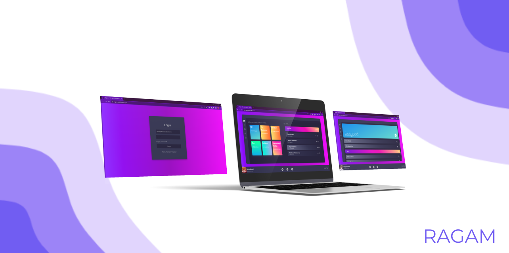
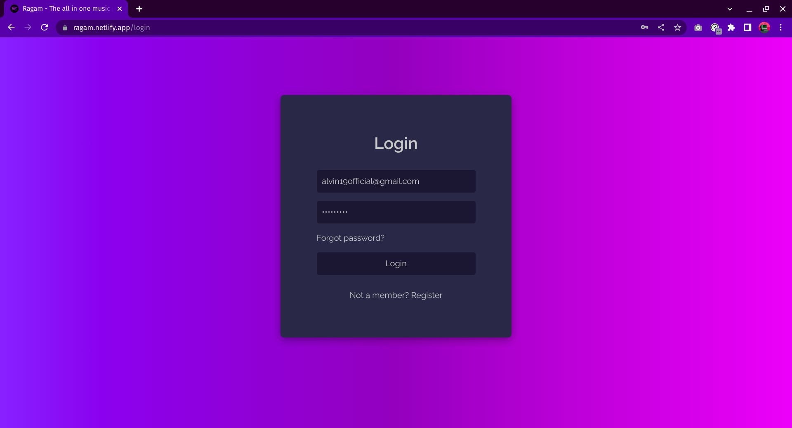
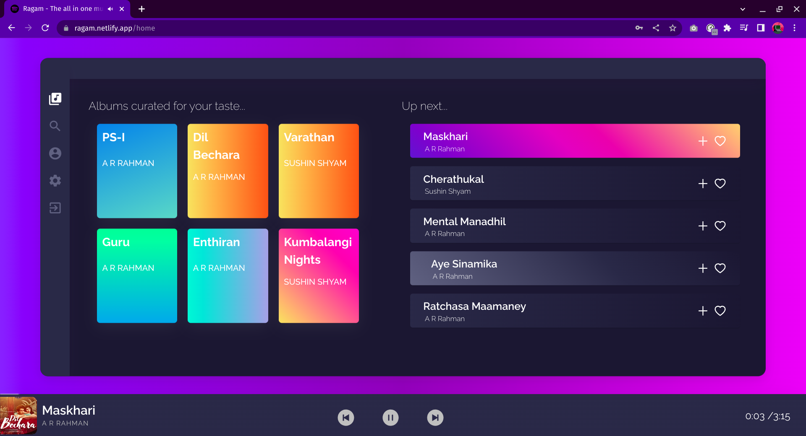
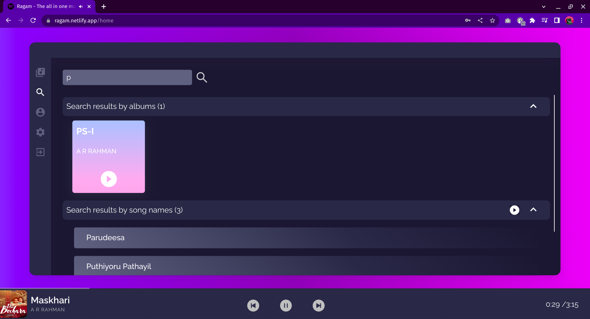
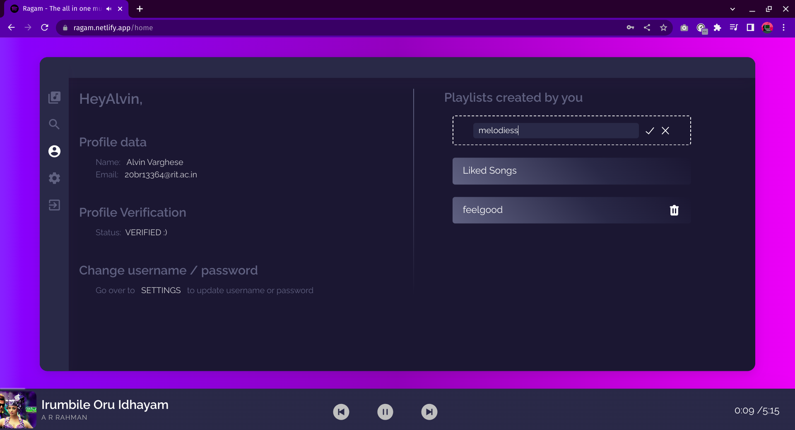
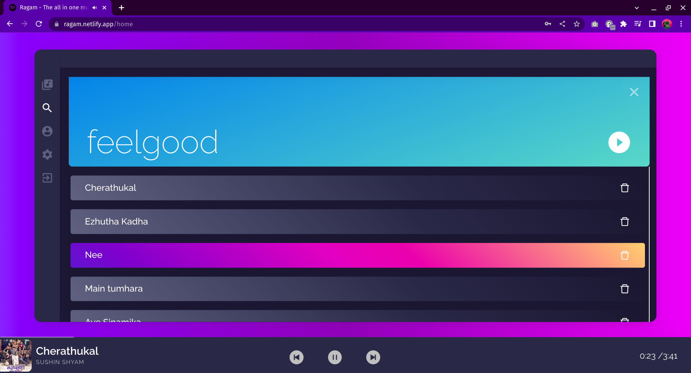

# :musical_note: RAGAM Music App

RAGAM is a music streaming and curation app built using the MERN stack. It allows users to stream music, create playlists, add songs to them, and search for songs from a vast list of available tracks. Additionally, RAGAM can generate a random playlist for users who want to discover new music. 

The app also features user profiles, where users can edit their details and view their listening history. With a clean and intuitive user interface, RAGAM offers a seamless experience for music lovers to enjoy their favorite tunes and explore new ones.

The client side of the app is built using REACT framework. The client is deployed on Netlify. The server side of the app is built using Node.js and Express.js. The database used is MongoDB (visit important links to go to server repo). 

## TABLE OF CONTENTS

- [Important Links](#important-links)
- [Configuration for Local Deployment](#configuration-for-local-deployment)
- [Tech Stack](#tech-stack)
- [Features](#features)
- [Screenshots](#screenshots)
- [Contributors](#contributors)

## Important Links

- Visit website @ https://ragam.netlify.app/
- Visit companion website @ https://ragam-companion.netlify.app/
- Visit API repo @ https://github.com/sm0483/music-app-server.git
- Visit Client repo @ https://github.com/alvin1904/Ragam-Music-Streaming-App.git
- Visit Companion repo @ https://github.com/alvin1904/Ragam-Companion.git

## Configuration for Local Deployment

To deploy `RAGAM` on your local machine, follow these steps:

1. Clone the repository to your local machine
   `git clone https://github.com/your-username/RAGAM.git`
   and cd into the directory.
2. `npm install` to install all the dependencies.
3. `npm run dev` to start the client at localhost:5173

## Tech Stack
We used the MERN Stack as the core of our application. The full list of frameworks & tools used in the client is:

- HTML, CSS & React Js for front-end UI and Client-side logic
- react-icons for icons
- react-spring for animations and transitions

## Features
- Login to create and listen to your favorite songs & playlists.
- Stream music from a vast collection of available tracks
- Custom music player that can play/pause/forward/skip tracks.
- Generates a random playlist to discover new music
- Create playlists and add songs to them
- Search tracks by title, artist, language and genre.
- View and edit user profile details
- Smooth and intuitive user interface for easy navigation and use.
- Dynamic animations and transitions using react-spring library
- Icons from react-icons library for visually appealing and recognizable UI elements

## Screenshots

Here are some screenshots of our RAGAM Music App:

</img>
_Users can login or register here_
  

</img>
_This is the application's main interface and welcome screen. Users can interact fully with the app here._
  

</img>
_This is the search feature, which allows users to look for a specific song or playlist._
  

</img>
_This is the profile page, where users can view their profile details and create and delete their own playlists where they can keep the songs they like._
  

</img>
_Viewing songs in a playlist_
  

## Contributors

[Sreerag M](https://github.com/sm0483)
